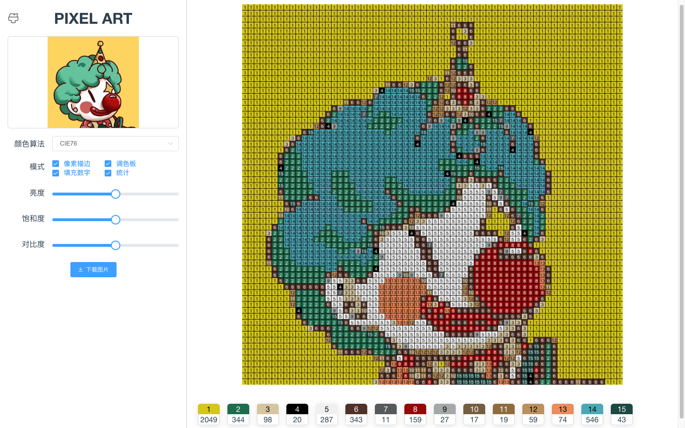

# 像素画

上传图片转换成像素画。


# 参考资料

## 颜色空间转换
https://github.com/brehaut/color-js  

## 亮度、饱和度调整
https://github.com/chenshenhai/pictool

## 颜色差异算法
https://zh.wikipedia.org/wiki/%E9%A2%9C%E8%89%B2%E5%B7%AE%E5%BC%82#CIEDE2000  
https://github.com/kenlimmj/empfindung  
https://github.com/Evercoder/d3-color-difference  
https://github.com/gfiumara/CIEDE2000  

## 对比度的原理（来源于网络）

```text
Photoshop对比度算法。可以用下面的公式来表示：

(1)nRGB = RGB + (RGB - Threshold) * Contrast / 255

公式中，nRGB表示图像像素新的R、G、B分量，RGB表示图像像素R、G、B分量，Threshold为给定的阀值，Contrast为处理过的对比度增量。

Photoshop对于对比度增量，是按给定值的正负分别处理的：

当增量等于-255时，是图像对比度的下端极限，此时，图像RGB各分量都等于阀值，图像呈全灰色，灰度图上只有1条线，即阀值灰度；

当增量大于-255且小于0时，直接用上面的公式计算图像像素各分量；

当增量等于 255时，是图像对比度的上端极限，实际等于设置图像阀值，图像由最多八种颜色组成，灰度图上最多8条线，即红、黄、绿、青、蓝、紫及黑与白；

当增量大于0且小于255时，则先按下面公式(2)处理增量，然后再按上面公式(1)计算对比度：

(2)、nContrast = 255 * 255 / (255 - Contrast) - 255

公式中的nContrast为处理后的对比度增量，Contrast为给定的对比度增量。
```


